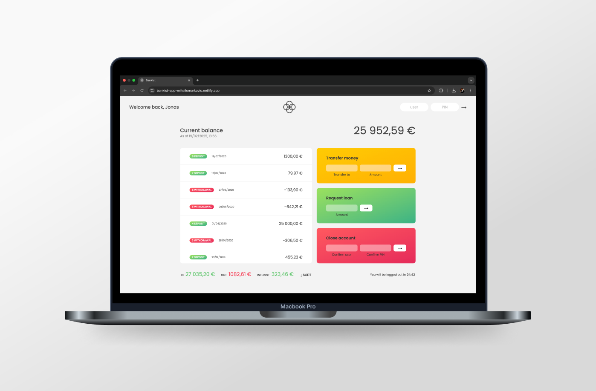

# [Bankist App 💰](https://bankist-app-mihailomarkovic.netlify.app/)

## Introduction

Bankist App is a fictional online banking application that demonstrates essential JavaScript concepts. It allows users to log in, view their financial transactions, transfer money, request loans, and manage their accounts. This project serves as a practical exercise in working with arrays, dates, internationalization, and timers in JavaScript.

## Project Highlights

- Developed a fully functional banking interface with user authentication.
- Implemented various JavaScript array methods to handle user transactions.
- Integrated date and time formatting based on the user's location.
- Implemented a session timeout feature using timers to log out inactive users.
- Built sorting functionality for transaction movements.
- Automated currency formatting based on the user's country currency.

## What I Learned

Through this project, I gained hands-on experience with:

- **JavaScript Arrays**: Learned how to manipulate arrays efficiently using advanced methods like `map()`, `filter()`, `reduce()`, and much more.
- **Numbers & Dates**: Worked extensively with JavaScript's `Intl` API for formatting numbers, dates, and currencies.
- **Timers**: Implemented `setTimeout` and `setInterval` to manage session expiration and real-time updates.
- **User Authentication (Basic Simulation)**: Enabled different users to log in and access their account details.
- **Sorting & Filtering**: Implemented sorting of transactions based on date and time.
- **Internationalization**: Used the `Intl` API to display dates and currencies correctly based on user location.
- **Event Handling & UI Updates**: Managed various user interactions dynamically.
- **Basic Asynchronous JavaScript Concepts**: Explored handling API data related to time, dates, and currency exchange.

## Project Features

- **User Login**: Different users can log in and access their accounts.
- **Transaction History**: View deposits and withdrawals, automatically formatted with dates and currency.
- **Sorting Transactions**: Transactions can be sorted by date.
- **Money Transfer**: Transfer funds between users.
- **Loan Request**: Users can request a loan based on specific conditions.
- **Account Closure**: Users can close their accounts.
- **Session Timeout**: Users are automatically logged out after a period of inactivity.

## Technologies Used

- **JavaScript (ES6+)**: Core logic and functionalities.
- **HTML & CSS**: UI structure and styling.
- **Intl API**: Used for date and currency formatting.

## Exploring the App

If you want to explore the site, use the following accounts:

- **Username**: js / **Password**: 1111

- **Username**: jd / **Password**: 2222

## Closing Thoughts

The Bankist App was an incredible learning experience that deepened my understanding of JavaScript and its built-in methods. It also helped me explore real-world banking application features and how they can be implemented effectively. This project strengthened my knowledge of arrays, dates, internationalization, and event handling while giving me a clearer understanding of JavaScript language.
